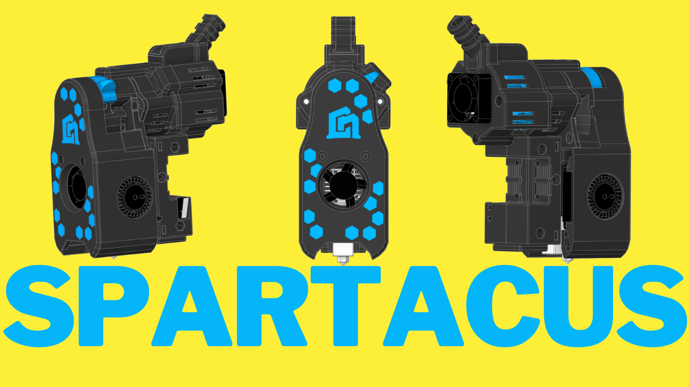
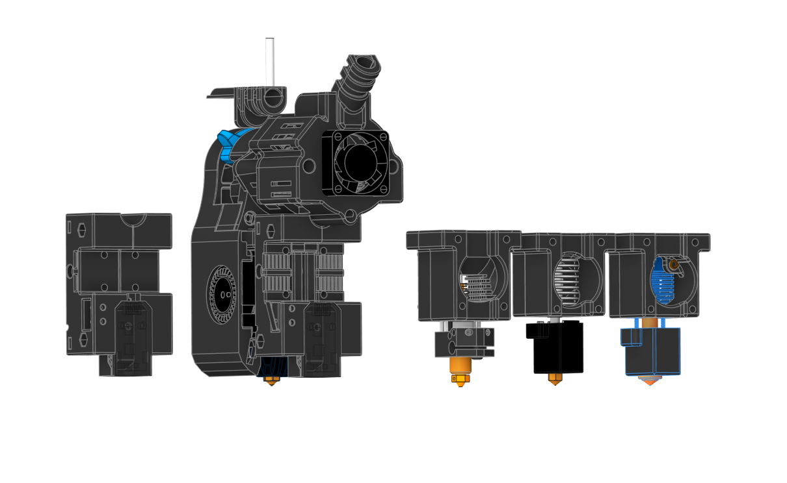
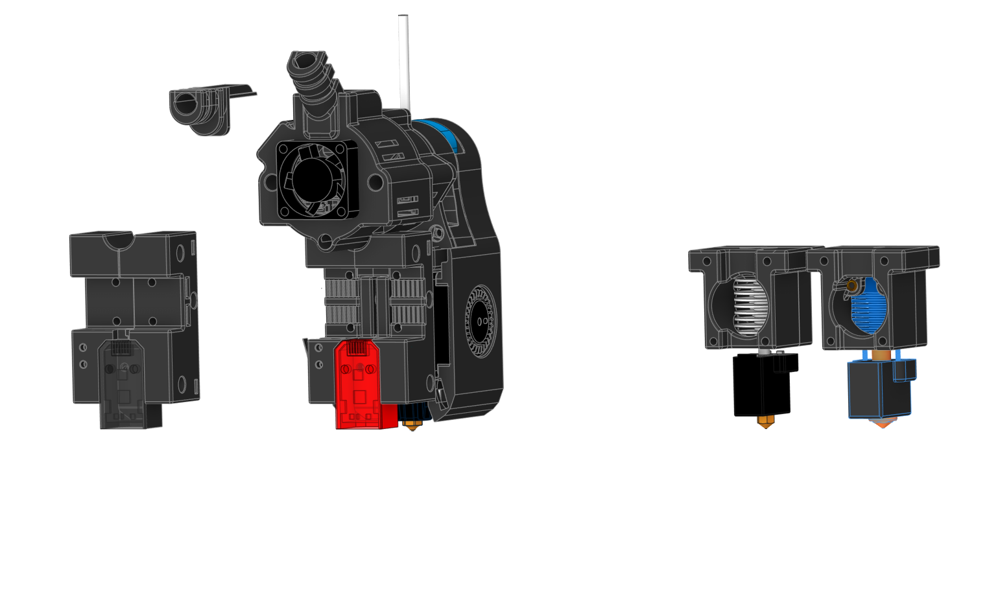

 
Later edit : 
added Rapido UHF as an option for the hotend 
we have added Eddy Support 

### Hello Everyone 

This is my take on building a small toolhead:
A project I have been working on for more than a year. It all  started when Voron Design launched V0.2 with the Mini StealthBurner
I liked that toolhead a lot but I wanted more. 
More Flow, more cooling and more features like LED and this is how i ended with CN3D 4010 Mini StealtBurner.
I always liked the idea to get out the most from anything I encounter.  I looked for a way to be on the budget and to achieve better quality and reasonable speeds. 
I will not talk more about the last year project but it’s important to let you know how I got to Spartacus!

After I managed to add in MSB everything that in my opinion was missing I thought “what if i’d have all of these in a smaller and lighter form?”. And this is how I ended up with a lighter  and narrower toolhead.

### Who is this Toolhead for? 

This is for someone who wants a light toolhead that looks good ,without messy cables,  tidy and has visible and lighted nozzle, that you can build with off the shelf components that doesn’t require a lot of money. 
I found a solution for every situation i have encountered on my journey to print fast on a budget. 

### Now, to correct what i said :
I didn’t crafted all the parts that I have used to create this toolhead. I just tested a lot to find the cheapest version to achieve  the results I was aiming for. 

### I got a lot of questions about the difference from the stock design. 

- It has bigger part cooling fans. I went further and I removed the cover from the fans and used the cowling as a fan cover.
- It has 2 neopixels.
- It has built in cable management and covers to hide all the messy spaghetti.
- It has passive cooling for the stepper motor, and all the flow/air from the hotend fan is routed to go up out of the build plate.
- It has different position for the idler gear to reduce some artifacts.

### It can be installed on any Voron v2.4 or trident or any other 3d printer that uses this gantry style. 

### The design goal:
- to have all of the above in less than 320 grams 
- to have a minimum flow of 35mm3/s and all the parts used to build this toolhead to be less than 120Euros.

 Spartacus: The Toolhead stands as a testament to lightweight engineering mastery, boasting a total weight of under 320 grams, with the potential to further reduce weight by implementing titanium screws. Every component, from the stepper motor to the thermistor, board cables, heater, LEDs, fans, heatsink, nozzle, and screws, has been meticulously crafted to maintain this featherlight profile without compromising on performance or durability. Spartacus redefines the possibilities of 3D printing toolheads, offering a combination of high performance and portability that is unmatched in its class. Dominate your printing projects with Spartacus: where innovation meets lightweight precision.

 Engineered with precision, Spartacus integrates a multitude of features including dual RGBW LEDs, direct drive capabilities, and an appealing aesthetic with concealed cables and motor covers. Compatible with both EBB36 and Piggyback 36 toolboards, Spartacus offers versatility without compromise. Weighing under 320 grams, its agile form minimizes inertia, enabling rapid accelerations and pristine print quality, free from artifacts. Unleash the power of Spartacus: where innovation meets agility.

## Key Features:

- Powerful direct drive extruder for rapid printing (Flow tested up to 55mm³/s)
- Utilizes the T-Volcano hotend for increased flow and faster prints
- Enhanced cooling with 3010 and dual 4010 GDS Time 12000 rpm fans
- Lightweight and compact design inspired by Voron Design (Mini Stealth Burner)
- Cost-efficient, with a total build cost under $75
- Versatile design allows for customization and adaptation to different setups
- 2 Neopixel LED lights for improved visibility and real-time print status updates

## Bill of Materials (BOM):

### Fans:

- 1 x 3010 GDS Time 12000 rpm Fan  https://s.click.aliexpress.com/e/_Dd0TMzH 
- 2 x 4010 GDS Time Blower Fan (12000 rpm dual ball bearing recommended for optimal cooling) https://s.click.aliexpress.com/e/_DevBF23 

### Hotend Components: For the Cheapest way posible hotend up to 32mm3/s without bumping the themperature if you want more use Rapidon 

- 1 x V6 Heat Sink (light weight) https://s.click.aliexpress.com/e/_DdVmCRp 
- 1 x BiMetal Heat Break https://s.click.aliexpress.com/e/_DdDpmGx 
- 1 x T-Volcano Heat Block https://s.click.aliexpress.com/e/_DdFLdPd
- 1 x Volcano Cht Nozzle https://s.click.aliexpress.com/e/_DFfottp
- 1 x Volcano CHT Hard Nozzle  https://s.click.aliexpress.com/e/_DD5d2Bh Best Budget nozzle 
- 1 x 65W Heater Cartridge (or higher) https://s.click.aliexpress.com/e/_DB6KBBH
- 1 x Thermistor Cartridge for V6 Volcano Heater Block 3x15 (PT100 style) NTC 100K M3950 up to 320c https://s.click.aliexpress.com/e/_DDBx7IL
- 1 x Nema 14 Pancake Stepper Motor https://s.click.aliexpress.com/e/_Dk2jz6F 
- 1 x BMG Dual Driver Gear Kit https://s.click.aliexpress.com/e/_DFUPonD 
- 1 x 30mm PTFE Tube 1.9mm ID 4mm OD
- 2 x Round PCB LED (WRGB, RGB, RGBW, WWRGB, etc.)  https://s.click.aliexpress.com/e/_DCkqzJz
- 1 x Ebb 36 Can boad https://s.click.aliexpress.com/e/_DkBHGcb 

### Optional Add-ons:

- Piggyback/Breakout Board ($9) 
- End caps for cable management based on your setup and chosen board an some cable management wrap 
- 1 x PT1000 Probe 3mm * 15mm Up to 450 Degree RTD 1m Platinum Thermal Resistance Sensor For 3D Printer Volcano/ V6 Heater Block https://s.click.aliexpress.com/e/_DeoYaER 

### Nozzle / Hotend Options (Optional, depending on preference):

- Volcano Cht Nozzle https://s.click.aliexpress.com/e/_DFfottp
- Volcano CHT Hard Nozzle  https://s.click.aliexpress.com/e/_DD5d2Bh Best Budget nozzle 
- Rapido UHF added https://s.click.aliexpress.com/e/_DdN6yC7  
  
## Hardware:

### Heatset Inserts:

- 1 x M3 x 5.7 x 4.5/4.6 Heatset Insert
- 8 x M3 x 3 x 4.5 Heatset Insert

### M3 Screws:  

- 3 x M3 x 6
- 5 x M3 x 10
- 3 x M3 x 25
- 1 x M3 Hex Nut
M3  Screws Kit https://s.click.aliexpress.com/e/_DBdNTVD   

#### This versatile and feature-packed 3D printer tool head provides an affordable solution for high-quality, high-speed printing, enhanced by Neopixel LED lights for improved visibility and dynamic print status updates.

#### Assembly of Spartacus requires minimal tools, including an 1.5mm drill bit, a drill, an angle grinder or hacksaw, and 1.5, 2 and 2.5mm Allen keys. With these tools, users can effortlessly assemble Spartacus and unleash its full potential.

### Here you can see how to build this Awesome Toolead

### If you want to see it in action you can see it here

##  <a href="assembly.md"  >  Assembly guide</a>

If you want to see it in action you will find videos on Tiktok  and Youtube
#### You can follow us on

### Tiktok https://www.tiktok.com/@3dprinttutorials

### Youtube https://www.youtube.com/@nadir3D 

### Facebook https://www.facebook.com/CN3DP/

### Printables https://www.printables.com/@Nadir

CN3D Spartacus is licensed under the
GNU General Public License v3.0
Permissions of this strong copyleft license are conditioned on making available complete source code of licensed works and modifications, which include larger works using a licensed work, under the same license. Copyright and license notices must be preserved. Contributors provide an express grant of patent rights.
